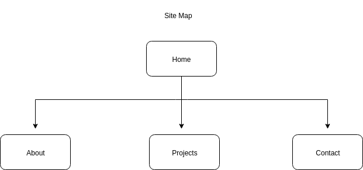

# Website-Portfolio-Assessment

## A Link to my Published Portfolio Website
Here's the link to my published protfolio website:

https://lelani82.github.io/index.html

__________________

## A Link to my GitHub Repository
Here's the link to my GitHub repository:

https://github.com/Lelani82/Lelani82.github.io

_________________

## A Description of my Portfolio Website

### The Purpose of my Portfolio Website

The purpose of my portfolio website is to showcase my current skills to both future employers and clients. It is also a great platform to share a bit about myself and my coding journey.

### Functionality / features 

I have included the following in my portfolio website:

● Links to my GitHub, Twitter and LinkedIn profiles (These are accessible from the footer on every page).

● An 'About' page which is all about my current studies at Coder Academy as well as the Tech Stacks I have learnt so far. I have also included any relevant past experience and qualifications and a list of all the workshops I have attended.  

● A 'Projects' page which has some information on our Ruby Terminal App Assessment. I have included a photo and a link to my GitHub Repo.

● A 'Contact' page which has a form for anyone who would like to contact me.

### Sitemap

Here's a sitemap of my website:

### Screenshots of Site: 

This is my 'Home' page:

This is my 'About' page:

This is my 'Projects' page:

This is my 'Contact' page:

### Target audience :

My target audience would be anyone I wish to show my portfolio to. I can use it to showcase my current skills and abilities as well as any past projects I have completed. This would include any potential future employers and even clients, if I chose to do freelancing.

   ###Tech stack (e.g. html, css, deployment platform, etc) 
   HTML
   SASS (CSS)
   JS

__________________________________

Design documentation including, 
   Design process 
   Originally wanted to do 1 page per day and test from there but ended up doing all mobile template layouts first, testing and then moving onto media queries & larger screens - way better
   Wireframes 
   Personal logo (optional) 
   Usability considerations 

## Design Process:
##Trello
Broke up tasks into Trello board with time estimates (update daily with README)
## Timeline
Did a timeline to break up my days and dedicate different tasks to days.
Project management - one day
Design - one day
Each Webpage - one day for each to build, design, test
Powerpoint Presentation - one day
Spell Check - one day
Friday - Completion date - finalize everything including README
Extra Day in case

### Mood Board:
Colours selected blues, purples
Opted for a darker, more sophisticated and professional tone
Typography - selected Merriweather as main font type and Montserrat
 as secondary font

## Wireframes
Compeleted wireframes. 1 for home for mobile and desktop. 1 for projects for mobile and desktop.

## Usability considerations
Dark background with lighter text, easier on the eyes
Font type easy to read
Include alt for images for screenreaders
Easy navigation for mobile - less is more
1 topic per page to help search engine optimusation

Details of planning process including, 
   Project plan & timeline 
   Screenshots of Trello board(s)

Short Answer Q&A 
 - Include short answers to the following questions, 
   Describe key events in the development of the internet from the 1980s to today (max. 150 words) 
   Define and describes the relationship between fundamental aspects of the internet such as: domains, web servers, DNS, and web browsers (max. 150 words) 
   Reflect on one aspect of the development of internet technologies and how it has contributed to the world today (max. 150 words)"