# Website-Portfolio-Assessment

## A Link to my Published Portfolio Website
Here's the link to my published protfolio website:

https://lelani82.github.io/index.html

__________________

## A Link to my GitHub Repository
Here's the link to my GitHub repository:

https://github.com/Lelani82/Lelani82.github.io

_________________

## A Description of my Portfolio Website

### The Purpose of my Portfolio Website

The purpose of my portfolio website is to showcase my current skills to both future employers and clients. It is also a great platform to share a bit about myself and my coding journey.

### My Websites Functionality / Features 

I have included the following in my portfolio website:

● Links to my GitHub, Twitter and LinkedIn profiles (These are accessible from the footer on every page).

● An 'About' page which is all about my current studies at Coder Academy as well as the Tech Stacks I have learnt so far. I have also included any relevant past experience and qualifications and a list of all the workshops I have attended.  

● A 'Projects' page which has some information on our Ruby Terminal App Assessment. I have included a photo and a link to my GitHub Repo.

● A 'Contact' page which has a form for anyone who would like to contact me.

### My Websites Sitemap

Here's a sitemap of my website:

### Screenshots of My Website 

This is my 'Home' page:

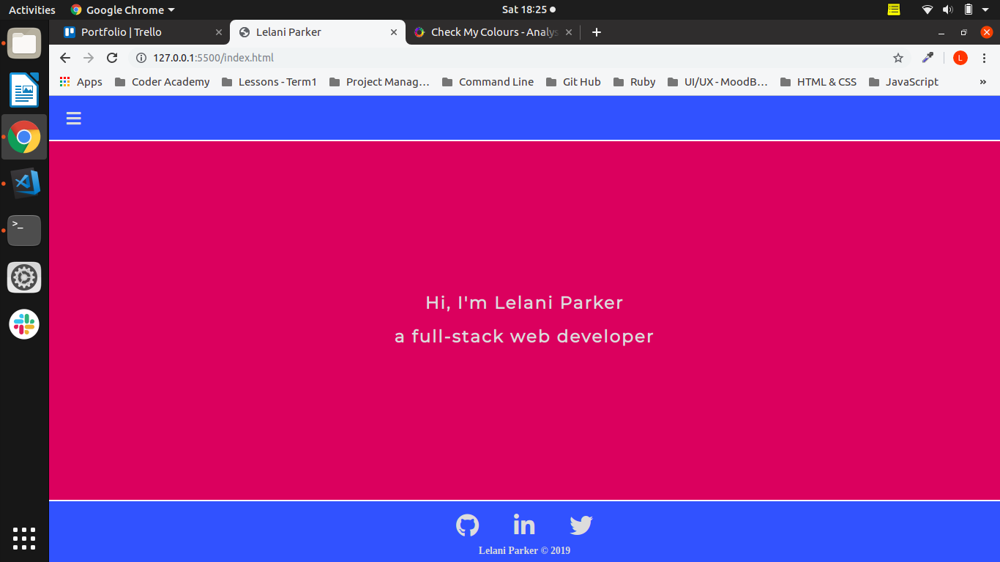

This is my 'About' page:

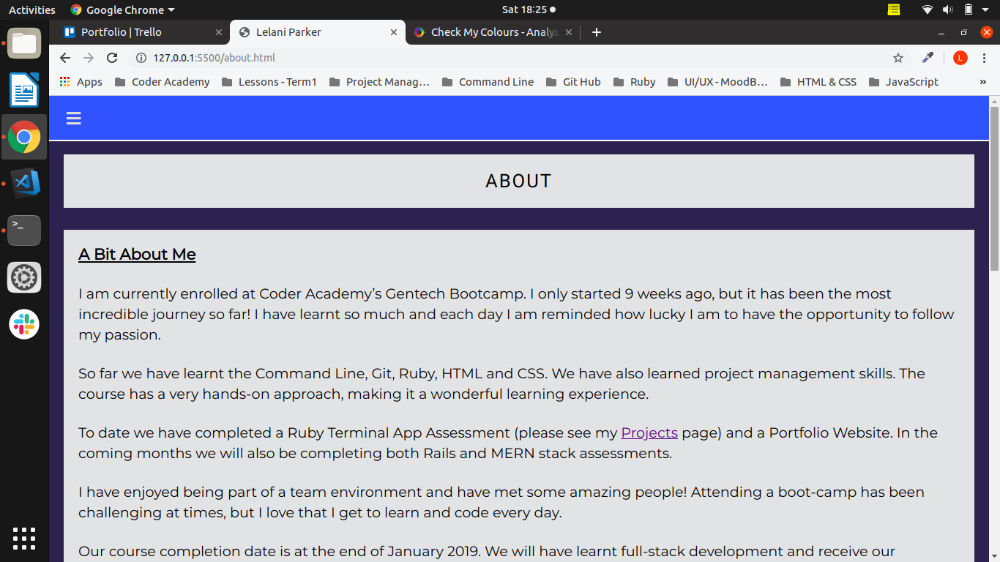

This is my 'Projects' page:

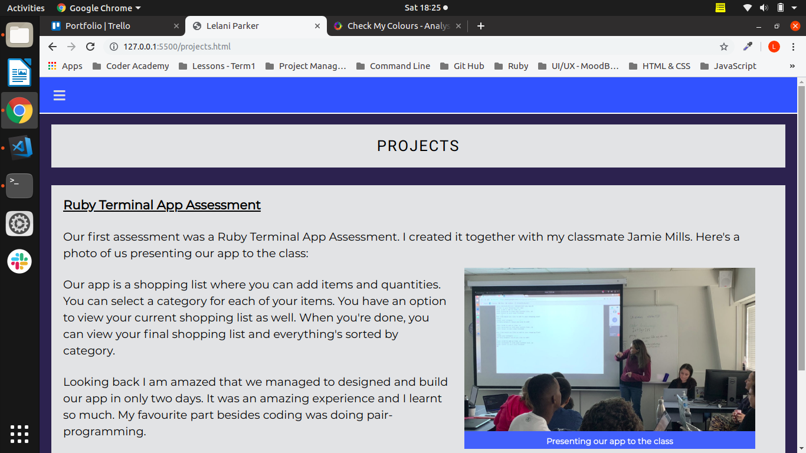

This is my 'Contact' page:

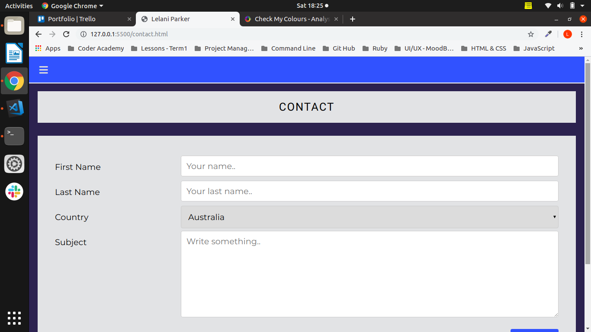

### My Websites Target Audience

My target audience would be anyone I wish to show my portfolio to. I can use it to showcase my current skills and abilities as well as any past projects I have completed. This would include any potential future employers and even clients, if I chose to do freelancing.

### Tech Stack that I Used

● HTML (Hypertext Markup Language)

As per W3C recommendations, I used HTML5 for the structure and layout of my web pages.  

● CSS (Cascading Style Sheet)

As per W3C recommendations, I used CSS3 for the styling of my web pages. 

● SASS (Syntactically Awesome Style Sheet)

I used Sass, an extension of CSS, to create my style sheets. I found it extremly helpful and noticed how much quicker I was able to create, edit and test all of my code.

I was able to use variables which sped up the process of changing fonts and colours. I found having an understanding of Ruby definitely helped with understanding how variables are created and implemented.

I used modularisation to seperate my files. This helped to keep my code organised and DRY. 

● GITHUB (Github Deployment)

I chose to use GitHub Pages to deploy my site. I found it helpful that I was able to simply push my commits and it would automatically update my website.

● JS (JavaScript) 

I only used a small bit of JavaScript in my website. It was to create a function for the hamburger menu. The function allows the user to toggle between showing and hiding the drop-down menu links whenever it is clicked on. I put the JavaScript code in its own file and linked it at the bottom of each of my HTML pages.
__________________________________

## My Design Documentation

### The Design Process

Stages to my design:

(1) Created a Timeline, Trello Board and Git Repo.

(2) Created my Mood Board, Wireframes and Sitemap.

(3) Created my first responsive page. I used a mobile first design. I chose to create templates and used dummy text to get my layout done first and then I could focus on my content at the end. To allow my pages to be responsive, I used a grid-container on each page and a flexbox for each of their inner divs. 

(4) Styled my first page and tested it with Chromes Dev Tools.

(5) Once I was happy I depolyed my site to see how it looked on my mobile (real-life).

(6) I then used my first page template to created the rest of the pages. I created them one by one, making any necessary changes as I went along.

(7) After all my pages were created and styled, I focused on my media queries for larger screens. I tested them with Chromes Dev Tools. I depolyed them to see how they looked on my desktop screen at home (real-life)

(8) I adjusted my colours, font styles and sizes and icon sizes until I was happy. Re-deploying and testing as I went along.

(9) I then wrote my content, page by page and put it through the Hemmingway Editor. I compressed my image and uploaded it. Testing and re-deploying as I went along.

(10) I made a few minor adjustments with any layout issues I had. Once again I tested and redployed as I went along.

(11) Once I was finally happy with everything, I re-did my HTML validation online. I also did a Lighthouse audit using Chrome's Dev Tools. I checked my site on different browsers and on different screen sizes. I used a screen reader to listen to my site as well.

### My Mood Board

I knew I wanted to avoid reds and greens on my site as it can be an issue for colour-blind people. After doing a bit of research, I opted to go with blue as it portrays a meaning of trust, loyalty, openness and calmness. This is definitly the feeling I wanted for on my site. I also ended up using purple as a secondary colour. For my Home page I went for a dark background with light font to give a more sophisticated and proffessional look.

I chose Merriweather as main font type and Montserrat as secondary font

 
Design Changes:
I ended up adding a bit more pink into my colour scheme as the dark blue and purple were too close in colour, and it made it difficult to see the changing keyframes on my Home page.

### My Websites Wireframes
 
● Home Page Wireframes (mobile and desktop):

● Projects Page Wireframes (mobile and desktop):

### Usability Considerations for My Website  

● Colour Considerations:

I avoided reds and greens and also used http://www.checkmycolours.com to check my colour contrasts online.

● Simple Language Considerations: 

I used the Hemingway Editor (http://www.hemingwayapp.com) to keep my sentences short and used easy to understand language.

● Larger Font Considerations:

I choose to use larger font sizes as I find it easier to read, especially on smaller mobile screens.

● Mobile Navigation Considerations:

I choose to use bigger buttons and icons for easier navigation on small mobile screens. 

● Search Engine Optimisation Considerations:

I kept to one topic per page which helps with Search Engine Optimisation. I also felt that it helps keep the content uncluttered.

● Quick Load Time Considerations: 

I compressed my image to speed up loading time.

● Multi Browser & Device onsiderations:

I tested my site on a variety of browsers and devices.

● Screen Readers Considerations: 

I used the alt attribute on my image to help with screen readers. I also added title attributes on all of my icon and navigation links. I tested my site with Natural Reader Text To Speech Chrome extension. 
_____________

## Site Testing

### Multi Screen and Browser Compatibility Testing:

I have tested my site on the following browsers and devices:

Desktop (Sony Laptop):

● Chrome Browser

● Firefox Browser

Tablet (Samsung Tablet):

● Chrome Browser

● Firefox Browser

● Opera Browser

Mobile (IPhone 5 and 7) :

● Safari Browser

● Chrome Browser

### HTML Validation:

I used the WC3 Online HTML Validation checker. Here are my screenshots:

● Index page validation:

● About page validation:

● Projects page validation:

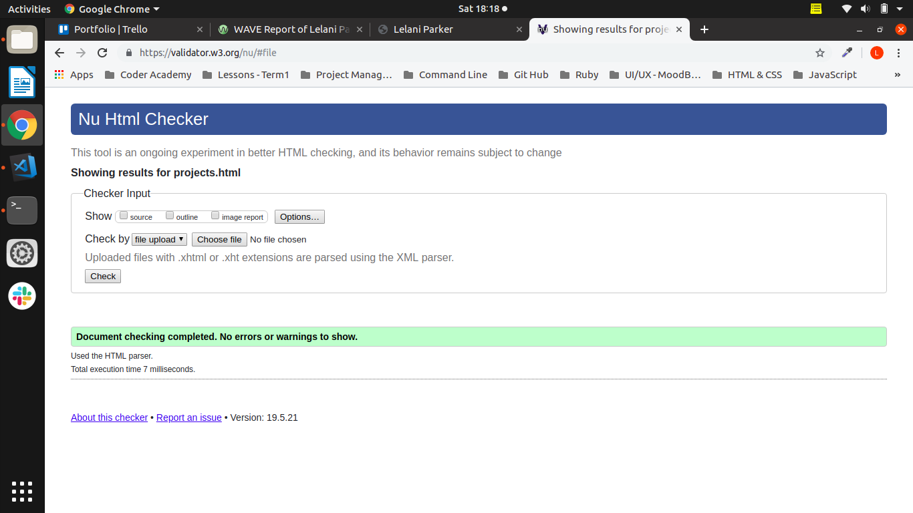

● Contact page validation:

### Wave Web Accessibility Evaluation Tool:

I used the Wave Web Accessibility Evaluation Tool to test my sites pages. Here are my screenshots:

● Index page evaluation:

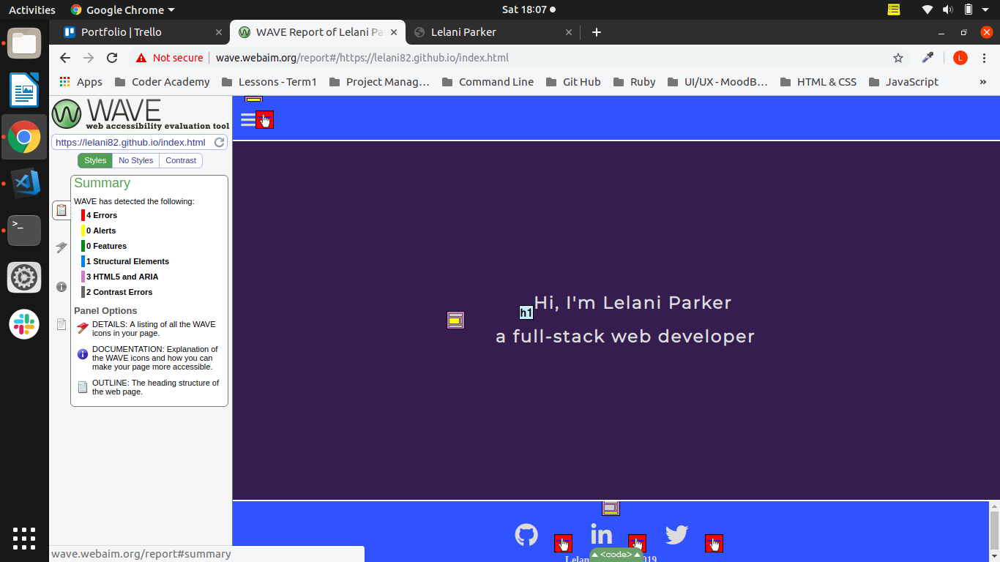

● About page evaluation:

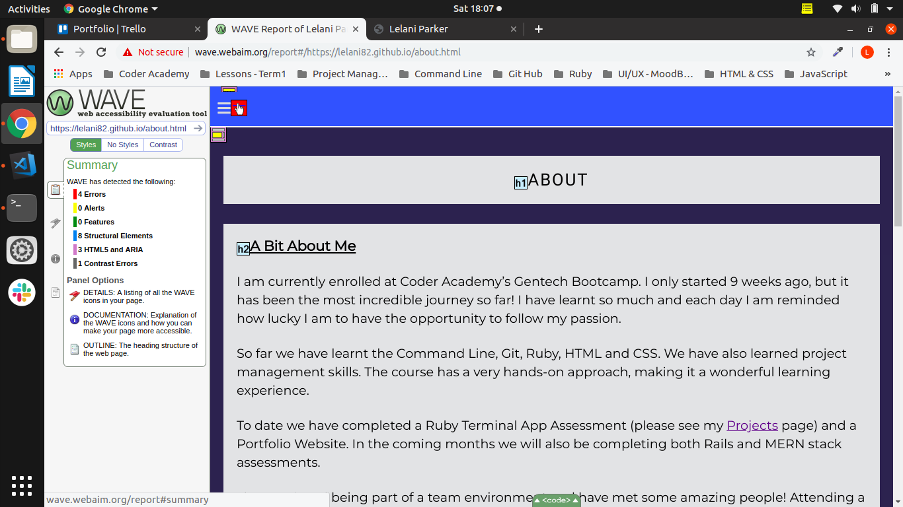

● Projects page evaluation:

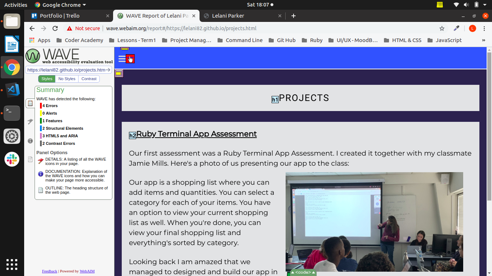

● Contact page evaluation:

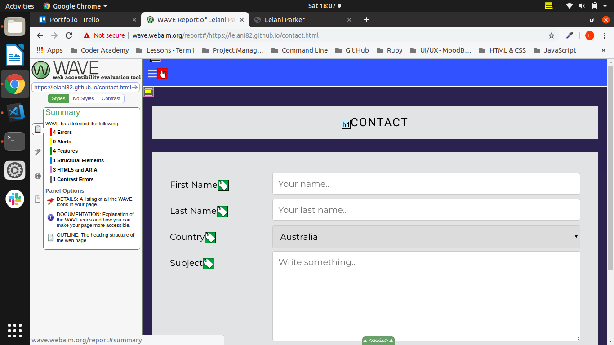

### Chromes Lighthouse Auditing Tool:

I used Chrome's Lighthouse Auditing tool to test my sites pages. Here is the screenshot:

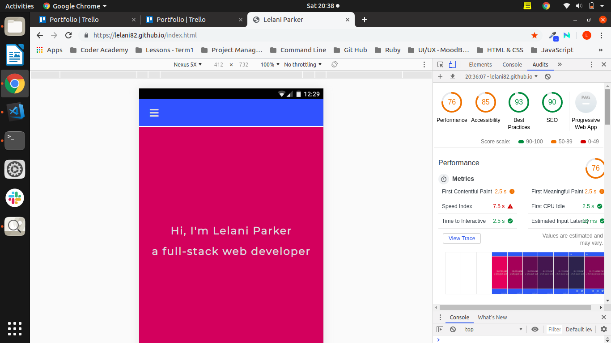

### Online Colour Checker:

I used http://www.checkmycolours.com to check my colour contrasts online. Here is the screenshot:

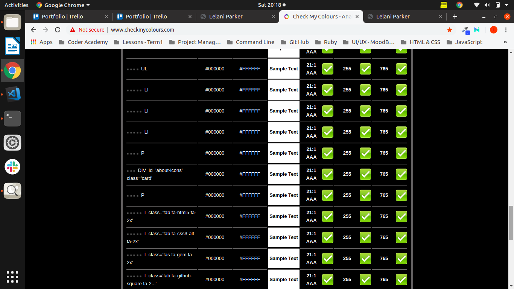
_______________________
## My Design Process:

### Created a Timeline
My first step in my design process was to create a timeline so that I could break up my avaiable days and dedicate different tasks to each day. This is how I initially broke it up:

● All project management - one day

● All design aspects - one day

● Build each webpage - one day to build and style each page of my site

● Testing webpages - four days to test and updating webpages

● Create my Powerpoint presentation - one day

● Spell check - one day

● Friday - Prefered completion date - one day to do the README, do a final spelling check and finalize everything else

● Saturday - An extra day just in case

Timeline Changes:

Originally wanted to do one page per day and test from there. I quickly found out that this was not the most efficient way because my first page took me the longest to build and style. I focused on creating a responsive mobile template for my first page and used dummy text. I deployed and tested my first page and made any necessary changes until I was happy with the look and layout. I was then able to copy my first page and use it as a template for my other pages. I then added my media queries and tested my site on a larger screen. Only then did I focus on adding all the content.

### Trello Board

First I broke up all my tasks with time estimates. I then added specific details to each task. As I completed tasks I updated my Trello Board. I found the Trello Board really handy for adding in reminders which popped up as I was working through the project. It was great to be able to refer back and see if I'd done everything I was suppose to.

Screenshots of my Trello Board:

● Day 1:

● Day 7:

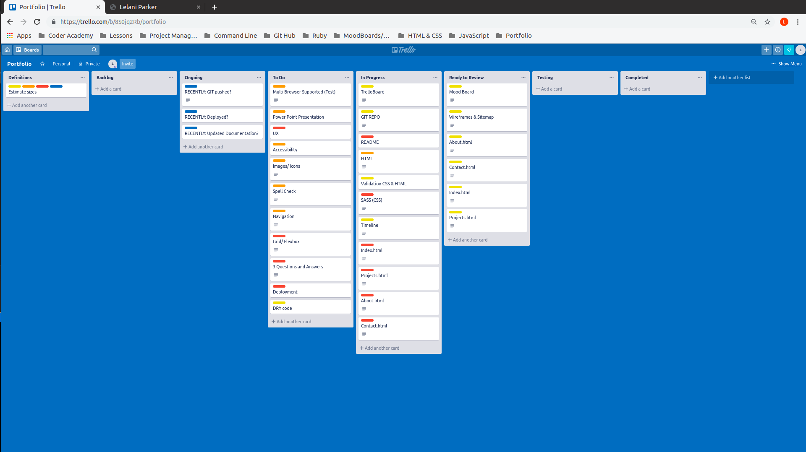

● Day 12:

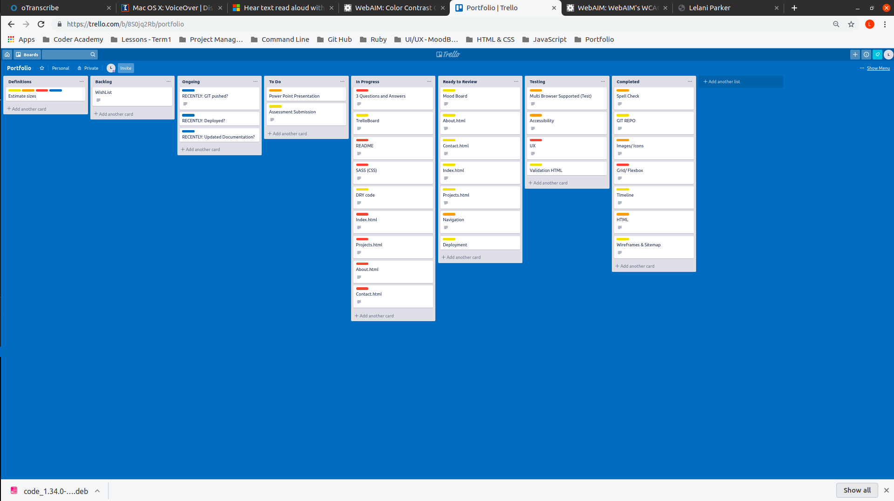

● Day 1:

________________________
## Short Answer Q&A 
 - Include short answers to the following questions, 
   Describe key events in the development of the internet from the 1980s to today (max. 150 words) 
   Define and describes the relationship between fundamental aspects of the internet such as: domains, web servers, DNS, and web browsers (max. 150 words) 
   Reflect on one aspect of the development of internet technologies and how it has contributed to the world today (max. 150 words)"